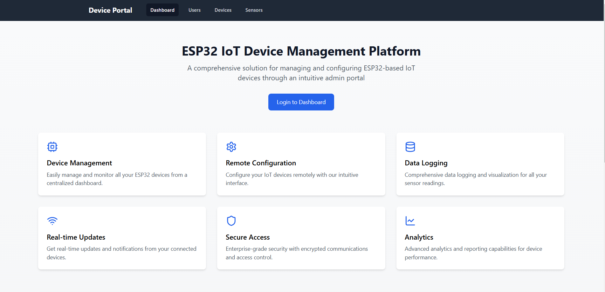
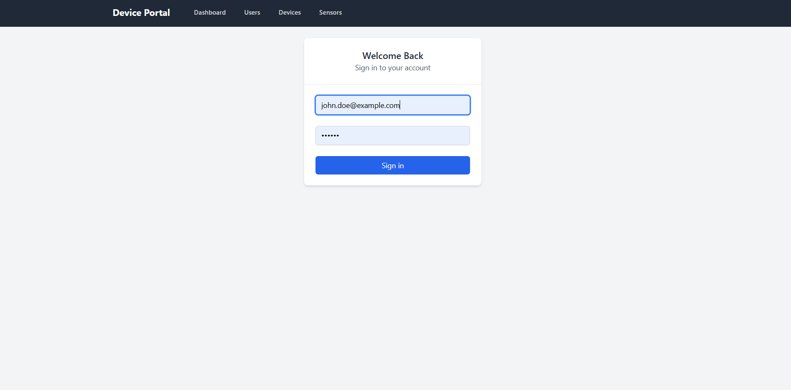
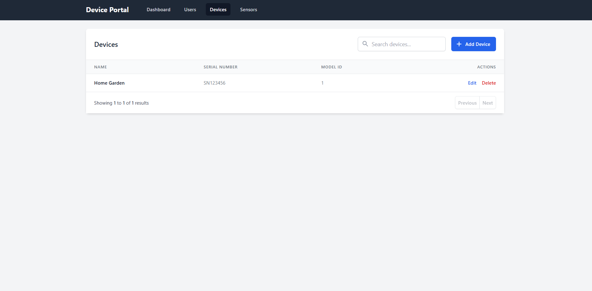
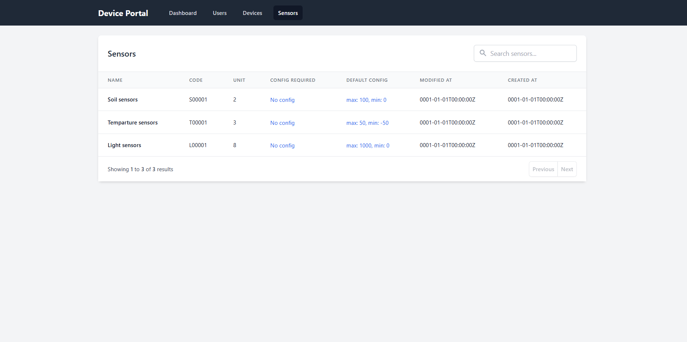
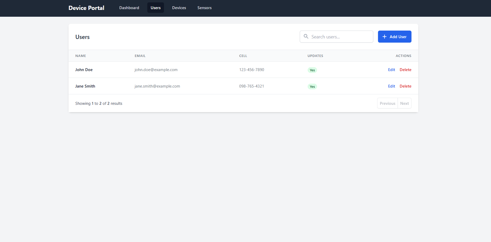

# ESP32 IoT Device Management Platform

A professional IoT device management solution built with Vue 3 and TypeScript, designed to configure and monitor ESP32-based devices through an intuitive admin interface.



## 🚀 Features

- **Secure Authentication System**
- **Device Management Dashboard**
- **Real-time Sensor Monitoring**
- **User Access Control**
- **ESP32 Configuration Interface**
- **RESTful API Integration**

## 💻 Technology Stack

- **Frontend Framework**: Vue 3
- **Language**: TypeScript
- **State Management**: Pinia
- **Routing**: Vue Router 4
- **Styling**: Tailwind CSS
- **HTTP Client**: Axios
- **Icons**: Lucide Vue

## 🖼️ Screenshots

### Authentication

Secure login interface with JWT authentication and role-based access control.

### Device Management

Comprehensive device management interface for monitoring and configuring ESP32 devices.

### Sensor Configuration

Real-time sensor data visualization and configuration panel.

### User Management

Administrative interface for user management and permission control.

## 🚀 Project Setup

```bash
# Install dependencies
yarn install

# Compiles and hot-reloads for development
yarn serve

# Compiles and minifies for production
yarn build
```

### Customize configuration
See [Configuration Reference](https://cli.vuejs.org/config/).

## 📐 Project Structure
```
device-frontend/
├── src/
│   ├── assets/          # Static assets
│   ├── components/      # Reusable Vue components
│   ├── composables/     # Vue composables
│   ├── layouts/         # Layout components
│   ├── pages/          # Page components
│   ├── router/         # Vue router configuration
│   ├── stores/         # Pinia stores
│   ├── types/          # TypeScript types/interfaces
│   ├── utils/          # Utility functions
│   └── App.vue         # Root component
├── public/             # Public static assets
└── vite.config.ts      # Vite configuration
```

## 🔒 Security Features

- JWT Authentication
- Role-Based Access Control (RBAC)
- Secure API Communication
- XSS Protection
- CSRF Protection

## 🔌 ESP32 Integration

### Supported Sensors
- Temperature & Humidity (DHT11, DHT22, BME280)
- Motion Detection (PIR sensors)
- Light Sensors (LDR, BH1750)
- Air Quality (MQ series)
- Custom sensor support through configuration

### Communication Protocol
- MQTT for real-time data
- HTTP for configuration
- WebSocket for live updates

## 💡 Core Functionalities

- Real-time device monitoring
- Sensor data visualization
- User management system
- Device configuration
- Automated reporting
- Alert system

## 📈 Future Enhancements

- [ ] Dark mode support
- [ ] Mobile application
- [ ] Advanced analytics dashboard
- [ ] Batch device configuration
- [ ] Custom sensor templates

## 📄 License

MIT License © Tannar Moss